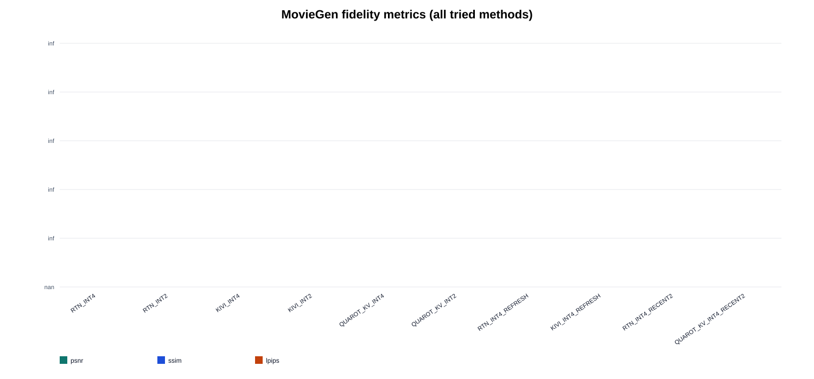
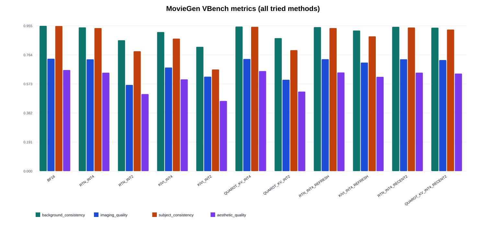
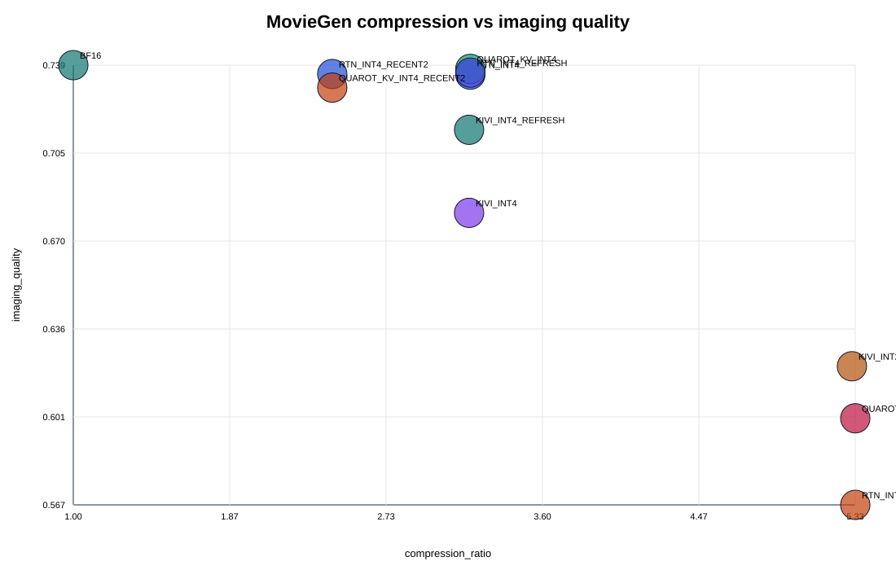
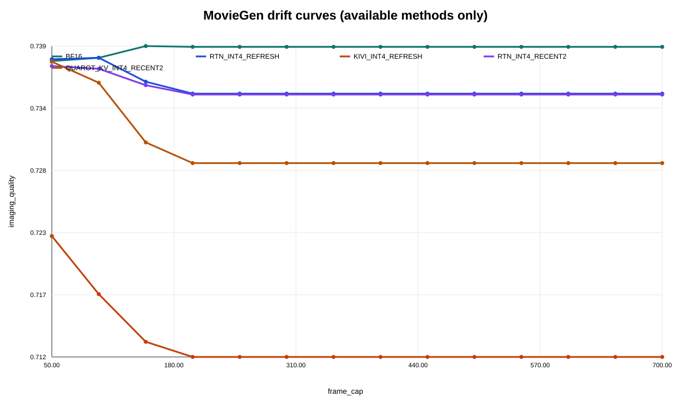
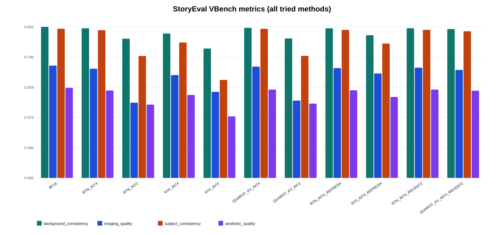
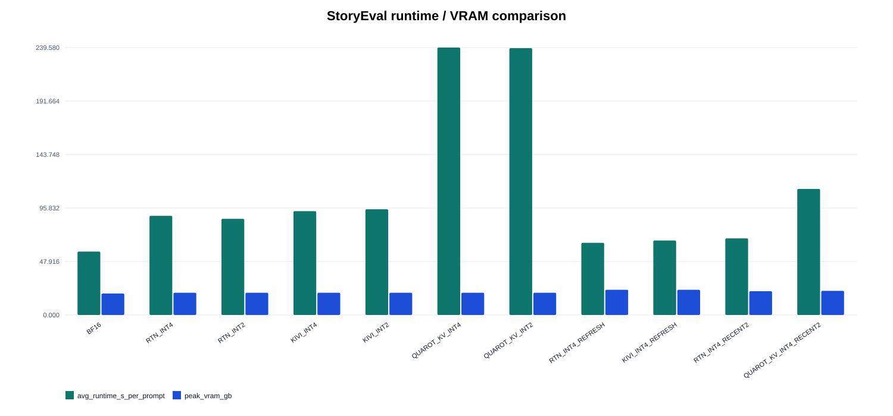
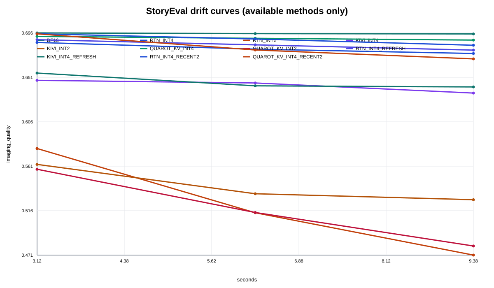

# Experiments

## Purpose

This document records the completed and attempted KV-cache quantization experiments for the Self-Forcing-Wan-1.3B setup in this repository, with emphasis on:

- motivation and research questions (RQs)
- implementation methodology
- exact run names and result directories
- MovieGen and StoryEval outcomes
- dashboard locations for inspection
- practical inferences from the results

This note is intentionally tied to the code and artifacts in this repo rather than to paper-level claims.

## Presentation Composite Runs

These two runs were created by collating existing artifacts only. They do not run new generation jobs and they do not consume GPU. They exist so the dashboard can present one benchmark-level comparison run for:

- baseline methods from the original baseline suites
- new method families from the later cache-policy runs
- attempted but incomplete methods where only partial data exists

Dashboard run labels:

- MovieGen: `runs/1773110004_presentation_moviegen_fullmatrix`
- StoryEval: `storyeval/storyeval_presentation_fullmatrix_1773110004`

Source provenance used in these composite runs:

- MovieGen baseline suite:
  - `results/runs/1772751420_baseline10s_10prompts_v3`
- MovieGen new-method suite:
  - `results/runs/1773038789_newideas10s_10prompts`
- MovieGen partial refresh-only QuaRot attempt:
  - `results/runs/1773037963_newideas10s_10prompts`
- StoryEval baseline suite:
  - `results/benchmarks/storyeval/storyeval_*_10prompts_10s_1772778648`
- StoryEval new-method suite:
  - `results/benchmarks/storyeval/storyeval_*_10prompts_10s_1773038789`

Important interpretation note:

- these are mixed-source presentation runs
- they are valid for method comparison and presentation inside this repo because the benchmark setup is matched (`10 prompts`, `10s`, `fps=16`, `target_frames=165`)
- MovieGen fidelity values still inherit the BF16 reference from the source run used for that method
- drift is only available where it was actually computed in the source artifacts

### MovieGen Full-Matrix Table

Full CSV:

- `docs/experiment_assets/moviegen_fullmatrix_summary.csv`

| method | status | videos | psnr | lpips | imaging_quality | compression_ratio | avg_runtime_s_per_prompt | peak_vram_gb | drift_last_imaging_quality |
| --- | --- | --- | --- | --- | --- | --- | --- | --- | --- |
| BF16 | complete | 10 |  |  | 0.7390 | 1.0000 | 58.5726 | 19.2801 | 0.7394 |
| RTN_INT4 | complete | 10 | 21.3205 | 0.1803 | 0.7353 | 3.2000 | 86.2636 | 19.9831 |  |
| RTN_INT2 | complete | 10 | 15.0444 | 0.4750 | 0.5668 | 5.3333 | 87.1161 | 19.9831 |  |
| KIVI_INT4 | complete | 10 | 13.0698 | 0.5709 | 0.6812 | 3.1933 | 92.6862 | 19.9904 |  |
| KIVI_INT2 | complete | 10 | 11.4240 | 0.6714 | 0.6211 | 5.3149 | 95.4773 | 19.9904 |  |
| QUAROT_KV_INT4 | complete | 10 | 22.6420 | 0.1483 | 0.7376 | 3.2000 | 236.6028 | 19.9831 |  |
| QUAROT_KV_INT2 | complete | 10 | 14.7310 | 0.4670 | 0.6008 | 5.3333 | 242.0181 | 19.9831 |  |
| RTN_INT4_REFRESH | complete | 10 | 21.4496 | 0.1777 | 0.7361 | 3.2000 | 65.0466 | 22.6361 | 0.7352 |
| KIVI_INT4_REFRESH | complete | 10 | 13.7329 | 0.5095 | 0.7137 | 3.1933 | 68.0524 | 22.6322 | 0.7116 |
| QUAROT_KV_INT4_REFRESH | partial_failed | 2 |  |  |  |  |  |  |  |
| RTN_K2_V4 | partial_failed | 5 |  |  |  |  |  |  |  |
| KIVI_K2_V4 | partial_failed | 3 |  |  |  |  |  |  |  |
| RTN_INT4_RECENT2 | complete | 10 | 23.6918 | 0.1482 | 0.7356 | 2.4348 | 68.8637 | 21.3741 | 0.7351 |
| QUAROT_KV_INT4_RECENT2 | complete | 10 | inf | 0.1834 | 0.7302 | 2.4348 | 111.3048 | 21.6854 | 0.7290 |

### MovieGen Plots

Fidelity:

VBench quality:

Quality-efficiency tradeoff:

Drift comparison for methods that have computed drift artifacts:

### StoryEval Full-Matrix Table

Full CSV:

- `docs/experiment_assets/storyeval_fullmatrix_summary.csv`

| method | status | videos | imaging_quality | background_consistency | subject_consistency | aesthetic_quality | avg_runtime_s_per_prompt | peak_vram_gb | drift_last_imaging_quality |
| --- | --- | --- | --- | --- | --- | --- | --- | --- | --- |
| BF16 | complete | 10 | 0.6932 | 0.9322 | 0.9207 | 0.5559 | 56.8107 | 19.2057 | 0.6951 |
| RTN_INT4 | complete | 10 | 0.6738 | 0.9235 | 0.9118 | 0.5393 | 88.7893 | 19.9087 | 0.6753 |
| RTN_INT2 | complete | 10 | 0.4644 | 0.8591 | 0.7528 | 0.4525 | 86.1275 | 19.9087 | 0.4709 |
| KIVI_INT4 | complete | 10 | 0.6348 | 0.8913 | 0.8354 | 0.5121 | 92.9985 | 19.9160 | 0.6352 |
| KIVI_INT2 | complete | 10 | 0.5312 | 0.7984 | 0.6049 | 0.3797 | 94.7113 | 19.9160 | 0.5271 |
| QUAROT_KV_INT4 | complete | 10 | 0.6870 | 0.9262 | 0.9203 | 0.5451 | 239.5797 | 19.9087 | 0.6889 |
| QUAROT_KV_INT2 | complete | 10 | 0.4775 | 0.8607 | 0.7535 | 0.4586 | 239.0473 | 19.9087 | 0.4802 |
| RTN_INT4_REFRESH | complete | 10 | 0.6779 | 0.9235 | 0.9136 | 0.5408 | 64.6068 | 22.5617 | 0.6787 |
| KIVI_INT4_REFRESH | complete | 10 | 0.6448 | 0.8808 | 0.8295 | 0.4995 | 66.7335 | 22.5578 | 0.6414 |
| QUAROT_KV_INT4_REFRESH | not_run | 0 |  |  |  |  |  |  |  |
| RTN_K2_V4 | not_run | 0 |  |  |  |  |  |  |  |
| KIVI_K2_V4 | not_run | 0 |  |  |  |  |  |  |  |
| RTN_INT4_RECENT2 | complete | 10 | 0.6803 | 0.9235 | 0.9142 | 0.5452 | 68.6420 | 21.2996 | 0.6836 |
| QUAROT_KV_INT4_RECENT2 | complete | 10 | 0.6665 | 0.9188 | 0.9049 | 0.5383 | 112.9255 | 21.6109 | 0.6698 |

### StoryEval Plots

VBench quality:

Runtime and peak VRAM:

Drift comparison:

### How To View These In The Dashboard

1. Set `Benchmark = moviegen`
2. Choose `runs/1773110004_presentation_moviegen_fullmatrix`
3. Use the `Methods` multiselect to compare baseline methods, new methods, and partial methods in one place

For StoryEval:

1. Set `Benchmark = storyeval`
2. Choose `storyeval/storyeval_presentation_fullmatrix_1773110004`
3. Use the `Methods` multiselect to compare baseline methods, new methods, and placeholder rows for methods that were not run on StoryEval

## Experimental Context

### Model and generation setup

All experiments in this note use the same base generation stack:

- model family: `Self-Forcing-Wan-1.3B`
- inference wrapper: `scripts/01_generate.py`
- StoryEval runner: `scripts/run_storyeval.py`
- Self-Forcing chunk-wise autoregressive generation path: `third_party/Self-Forcing/pipeline/causal_inference.py`
- KV-cache hook point: `third_party/Self-Forcing/wan/modules/causal_model.py`

Relevant code locations:

- method parsing and cache-policy injection:
  - `scripts/01_generate.py:281`
  - `scripts/run_storyeval.py:34`
- quantized KV state attachment to the pipeline:
  - `scripts/01_generate.py:330`
- refresh-only cadence switch inside the denoising loop:
  - `third_party/Self-Forcing/pipeline/causal_inference.py:187`
- quantized cache reconstruction, active-prefix quantization, and recent-window handling:
  - `third_party/Self-Forcing/wan/modules/causal_model.py:200`
- quantizer implementations:
  - `kv_quant/base.py`
  - `kv_quant/rtn.py`
  - `kv_quant/kivi.py`
  - `kv_quant/quarot_kv.py`

### Temporal configuration

These experiments used the current repo defaults:

- target duration: `10s`
- fps: `16`
- generation latent frames: `42`
- decoded output frames observed in runs: `165`
- `num_frame_per_block = 3`

The important implication is that all recency settings described below operate in units of runtime blocks, where one block corresponds to `3` latent frames.

### Benchmarks used

#### MovieGen

Prompt source:

- `prompts/MovieGenVideoBench_extended.txt`

For these experiments, the run used a `10`-prompt slice.

Metrics recorded:

- fidelity vs BF16: `PSNR`, `SSIM`, `LPIPS`
- VBench perceptual metrics:
  - `background_consistency`
  - `imaging_quality`
  - `subject_consistency`
  - `aesthetic_quality`
- system metrics:
  - `compression_ratio`
  - `total_runtime_s`
  - `peak_vram_bytes`
  - `quantize_time_s`
  - `dequantize_time_s`
- long-horizon drift:
  - `imaging_quality` over frame prefixes via `scripts/04_eval_drift_curve.py`

#### StoryEval

Prompt source:

- `data/prompts/storyeval/all_prompts.txt`

For these experiments, the run used a `10`-prompt slice.

Metrics recorded:

- VBench perceptual metrics in `summary/summary.json`
- drift summary via `drift_last_imaging_quality`
- runtime and peak VRAM summary per method

## Run Registry

### Main completed run set

The completed stable experiment family is anchored to timestamp `1773038789`.

#### MovieGen stable run

- run name: `1773038789_newideas10s_10prompts`
- root: `results/runs/1773038789_newideas10s_10prompts`
- main summary files:
  - `results/runs/1773038789_newideas10s_10prompts/tables/baseline_summary.csv`
  - `results/runs/1773038789_newideas10s_10prompts/tables/baseline_summary.md`

#### StoryEval stable runs

These are stored per method on disk and grouped by timestamp in the dashboard.

- `results/benchmarks/storyeval/storyeval_BF16_10prompts_10s_1773038789`
- `results/benchmarks/storyeval/storyeval_RTN_INT4_REFRESH_10prompts_10s_1773038789`
- `results/benchmarks/storyeval/storyeval_KIVI_INT4_REFRESH_10prompts_10s_1773038789`
- `results/benchmarks/storyeval/storyeval_RTN_INT4_RECENT2_10prompts_10s_1773038789`
- `results/benchmarks/storyeval/storyeval_QUAROT_KV_INT4_RECENT2_10prompts_10s_1773038789`

### Attempted but unstable methods in the same experiment family

These were attempted and should be considered part of the experiment record, but they did not complete the full 10-prompt benchmark cleanly:

- `RTN_K2_V4`
- `KIVI_K2_V4`

Artifacts:

- partial MovieGen outputs live under:
  - `results/runs/1773038789_newideas10s_10prompts/videos/RTN_K2_V4`
  - `results/runs/1773038789_newideas10s_10prompts/videos/KIVI_K2_V4`
- failing logs:
  - `results/runs/1773038789_newideas10s_10prompts/logs/generate_RTN_K2_V4.log`
  - `results/runs/1773038789_newideas10s_10prompts/logs/generate_KIVI_K2_V4.log`
- successful one-prompt validation probes:
  - `tmp/remainder_probe_rtn_k2v4`
  - `tmp/remainder_probe_kivi_k2v4`

Interpretation: these asymmetric methods are functionally implemented, but not yet robust enough for the full 10-prompt production run on the current A5000 setup.

## Method Families, Motivation, and Methodology

## 1. BF16

### Motivation

`BF16` is the reference system. It answers the baseline question:

- what do we lose when we quantize the KV cache at all?

### Methodology

No KV quantization is applied.

Implementation path:

- `parse_method(...)=BF16` in `scripts/01_generate.py` and `scripts/run_storyeval.py`
- no quantizer object is attached
- the stock Self-Forcing cache path remains active

### Runs and result dirs

MovieGen:

- `results/runs/1773038789_newideas10s_10prompts/videos/BF16`

StoryEval:

- `results/benchmarks/storyeval/storyeval_BF16_10prompts_10s_1773038789`

### Results

MovieGen:

- VBench:
  - `background_consistency 0.9554`
  - `imaging_quality 0.7390`
  - `subject_consistency 0.9544`
  - `aesthetic_quality 0.6649`
- runtime: `585.73s`
- peak VRAM: `20.70 GB`
- compression ratio: `1.0x`

StoryEval:

- avg runtime: `56.81s`
- avg peak VRAM: `19666.66 MB`
- VBench:
  - `background_consistency 0.9322`
  - `imaging_quality 0.6932`
  - `subject_consistency 0.9207`
  - `aesthetic_quality 0.5559`
- drift last imaging quality: `0.6951`

### Inference

This remains the quality target. No quantized method in this run exceeded BF16 in perceptual quality on either benchmark.

## 2. RTN_INT4_REFRESH

### Motivation / RQ

Research question:

- does quantizing only after a generated block is finalized reduce accumulated quantization error relative to quantizing every denoising step?

This is the lowest-risk experimental change because it modifies cadence, not quantizer math.

### Methodology

Implementation details:

- quantizer math: RTN symmetric KV quantization in `kv_quant/rtn.py`
- bitwidth: `INT4`
- cache policy:
  - `cadence = refresh_only`
  - `recent_blocks = 0`
- cadence switch:
  - inner denoising steps set `quantize_on_write = False`
  - clean-context refresh sets `quantize_on_write = True`
- key implementation points:
  - `third_party/Self-Forcing/pipeline/causal_inference.py:187`
  - `third_party/Self-Forcing/wan/modules/causal_model.py:279`

### Runs and result dirs

MovieGen:

- `results/runs/1773038789_newideas10s_10prompts/videos/RTN_INT4_REFRESH`

StoryEval:

- `results/benchmarks/storyeval/storyeval_RTN_INT4_REFRESH_10prompts_10s_1773038789`

### Results

MovieGen:

- `PSNR 21.4496`
- `SSIM 0.6934`
- `LPIPS 0.1777`
- VBench:
  - `background_consistency 0.9468`
  - `imaging_quality 0.7361`
  - `subject_consistency 0.9407`
  - `aesthetic_quality 0.6488`
- compression ratio: `3.2x`
- runtime: `650.47s`
- peak VRAM: `24.31 GB`

StoryEval:

- avg runtime: `64.61s`
- avg peak VRAM: `23103.16 MB`
- VBench:
  - `background_consistency 0.9235`
  - `imaging_quality 0.6779`
  - `subject_consistency 0.9136`
  - `aesthetic_quality 0.5408`
- drift last imaging quality: `0.6787`

### Inference

This is the best high-compression method in the completed set. It preserves quality much better than KIVI refresh and is materially cheaper than QuaRot recent2.

## 3. KIVI_INT4_REFRESH

### Motivation / RQ

Research question:

- if the cadence is improved in the same way, does KIVI's asymmetric key/value quantization recover enough quality to compete with RTN-based refresh-only compression?

### Methodology

Implementation details:

- quantizer math: KIVI-style asymmetric quantization in `kv_quant/kivi.py`
- keys quantized per-channel across sequence blocks
- values quantized per-token
- bitwidth: `INT4`
- cache policy:
  - `cadence = refresh_only`
  - `recent_blocks = 0`

### Runs and result dirs

MovieGen:

- `results/runs/1773038789_newideas10s_10prompts/videos/KIVI_INT4_REFRESH`

StoryEval:

- `results/benchmarks/storyeval/storyeval_KIVI_INT4_REFRESH_10prompts_10s_1773038789`

### Results

MovieGen:

- `PSNR 13.7329`
- `SSIM 0.4203`
- `LPIPS 0.5095`
- VBench:
  - `background_consistency 0.9245`
  - `imaging_quality 0.7137`
  - `subject_consistency 0.8863`
  - `aesthetic_quality 0.6199`
- compression ratio: `3.1933x`
- runtime: `680.52s`
- peak VRAM: `24.30 GB`

StoryEval:

- avg runtime: `66.73s`
- avg peak VRAM: `23099.15 MB`
- VBench:
  - `background_consistency 0.8808`
  - `imaging_quality 0.6448`
  - `subject_consistency 0.8295`
  - `aesthetic_quality 0.4995`
- drift last imaging quality: `0.6414`

### Inference

This method completed stably, but the quality drop is too large relative to RTN-based options. In the current implementation, KIVI refresh-only is not competitive.

## 4. RTN_INT4_RECENT2

### Motivation / RQ

Research question:

- if the last two runtime blocks stay in BF16 while older context is quantized, does long-horizon quality improve more than a uniformly quantized cache?

This directly targets the hypothesis that recent context is more important than old context in autoregressive long-horizon video generation.

### Methodology

Implementation details:

- quantizer math: RTN in `kv_quant/rtn.py`
- bitwidth: `INT4`
- cache policy:
  - `cadence = per_step`
  - `recent_blocks = 2`
- recent-window handling lives in:
  - `third_party/Self-Forcing/wan/modules/causal_model.py:285`
  - `third_party/Self-Forcing/wan/modules/causal_model.py:297`

### Runs and result dirs

MovieGen:

- `results/runs/1773038789_newideas10s_10prompts/videos/RTN_INT4_RECENT2`

StoryEval:

- `results/benchmarks/storyeval/storyeval_RTN_INT4_RECENT2_10prompts_10s_1773038789`

### Results

MovieGen:

- `PSNR 23.6918`
- `SSIM 0.7320`
- `LPIPS 0.1482`
- VBench:
  - `background_consistency 0.9490`
  - `imaging_quality 0.7356`
  - `subject_consistency 0.9444`
  - `aesthetic_quality 0.6474`
- compression ratio: `2.4348x`
- runtime: `688.64s`
- peak VRAM: `22.95 GB`

StoryEval:

- avg runtime: `68.64s`
- avg peak VRAM: `21810.83 MB`
- VBench:
  - `background_consistency 0.9235`
  - `imaging_quality 0.6803`
  - `subject_consistency 0.9142`
  - `aesthetic_quality 0.5452`
- drift last imaging quality: `0.6836`

### Inference

This is the best overall quantized method from the completed run set. It gives the strongest fidelity on MovieGen and the best long-horizon quality on StoryEval among the completed quantized methods.

## 5. QUAROT_KV_INT4_RECENT2

### Motivation / RQ

Research question:

- can QuaRot's rotation-aware KV quantization benefit from the same recent-window protection and close the gap to BF16 without a large quality loss?

### Methodology

Implementation details:

- quantizer math: rotation-aware KV quantization in `kv_quant/quarot_kv.py`
- rotation is applied on the channel axis before RTN-style quantization
- bitwidth: `INT4`
- cache policy:
  - `cadence = per_step`
  - `recent_blocks = 2`

### Runs and result dirs

MovieGen:

- `results/runs/1773038789_newideas10s_10prompts/videos/QUAROT_KV_INT4_RECENT2`

StoryEval:

- `results/benchmarks/storyeval/storyeval_QUAROT_KV_INT4_RECENT2_10prompts_10s_1773038789`

### Results

MovieGen:

- `PSNR inf`
- `SSIM 0.7058`
- `LPIPS 0.1834`
- VBench:
  - `background_consistency 0.9433`
  - `imaging_quality 0.7302`
  - `subject_consistency 0.9309`
  - `aesthetic_quality 0.6413`
- compression ratio: `2.4348x`
- runtime: `1113.05s`
- peak VRAM: `23.28 GB`
- quantize/dequantize times are the highest of the completed set

StoryEval:

- avg runtime: `112.93s`
- avg peak VRAM: `22129.61 MB`
- VBench:
  - `background_consistency 0.9188`
  - `imaging_quality 0.6665`
  - `subject_consistency 0.9049`
  - `aesthetic_quality 0.5383`
- drift last imaging quality: `0.6698`

### Inference

This method is usable, but not efficient enough to be the preferred choice. It is much slower than RTN_INT4_RECENT2 while not matching it on StoryEval or MovieGen.

The `PSNR inf` entry in MovieGen should be treated cautiously; it suggests an edge case in the frame-level comparison rather than a trustworthy “perfect reconstruction” conclusion.

## 6. RTN_K2_V4

### Motivation / RQ

Research question:

- are values more sensitive than keys, such that `K=2 bits, V=4 bits` offers a better quality/compression tradeoff than symmetric quantization?

### Methodology

Implementation details:

- quantizer math: RTN in `kv_quant/rtn.py`
- bit allocation:
  - keys: `2 bits`
  - values: `4 bits`
- cache policy:
  - `cadence = per_step`
  - `recent_blocks = 0`

### Runs and result dirs

One-prompt validation probe:

- `tmp/remainder_probe_rtn_k2v4`

Partial 10-prompt MovieGen run:

- `results/runs/1773038789_newideas10s_10prompts/videos/RTN_K2_V4`
- `results/runs/1773038789_newideas10s_10prompts/logs/generate_RTN_K2_V4.log`

### Results

- one-prompt `10s` probe completed successfully
- full 10-prompt MovieGen run failed after `5/10` videos with CUDA OOM during quantization
- no completed StoryEval benchmark exists for this method

### Inference

The idea is promising enough to run on a single prompt, but not stable enough for production benchmark claims in the current implementation.

## 7. KIVI_K2_V4

### Motivation / RQ

Research question:

- does asymmetric K/V bit allocation help more when combined with KIVI's own asymmetric key/value handling?

### Methodology

Implementation details:

- quantizer math: KIVI in `kv_quant/kivi.py`
- bit allocation:
  - keys: `2 bits`
  - values: `4 bits`
- cache policy:
  - `cadence = per_step`
  - `recent_blocks = 0`

### Runs and result dirs

One-prompt validation probe:

- `tmp/remainder_probe_kivi_k2v4`

Partial 10-prompt MovieGen run:

- `results/runs/1773038789_newideas10s_10prompts/videos/KIVI_K2_V4`
- `results/runs/1773038789_newideas10s_10prompts/logs/generate_KIVI_K2_V4.log`

### Results

- one-prompt `10s` probe completed successfully
- full 10-prompt MovieGen run failed after `3/10` videos with CUDA OOM during quantization
- no completed StoryEval benchmark exists for this method

### Inference

This is currently weaker than RTN_K2_V4 in practical stability. It cannot yet be considered a completed benchmark result.

## Aggregate Findings

## Best method overall

The strongest quantized method in this completed experiment family is:

- `RTN_INT4_RECENT2`

Why:

- best completed quantized MovieGen fidelity
- best completed quantized StoryEval imaging quality and final drift point
- substantially faster than QuaRot recent2
- better quality than KIVI refresh-only

## Best high-compression method

If the priority is stronger compression rather than the best absolute quality, the best completed choice is:

- `RTN_INT4_REFRESH`

Why:

- `3.2x` compression ratio
- perceptual quality remains close to BF16 on MovieGen
- StoryEval quality is clearly stronger than KIVI refresh-only

## Weakest completed quantized method

- `KIVI_INT4_REFRESH`

Reason:

- similar compression to RTN refresh-only
- substantially worse fidelity and StoryEval quality

## Slowest completed method

- `QUAROT_KV_INT4_RECENT2`

Reason:

- much larger quantize/dequantize overhead
- much longer runtime on both benchmarks
- does not beat RTN_INT4_RECENT2 in the completed metrics

## Peak VRAM conclusion

A key implementation-level finding from this run is that completed quantized methods still did not beat BF16 in peak VRAM.

Observed MovieGen peaks from the completed stable set:

- `BF16`: `20.70 GB`
- `RTN_INT4_REFRESH`: `24.31 GB`
- `KIVI_INT4_REFRESH`: `24.30 GB`
- `RTN_INT4_RECENT2`: `22.95 GB`
- `QUAROT_KV_INT4_RECENT2`: `23.28 GB`

Interpretation:

- refresh-only and recent-window policies improved quality and stability
- recent-window methods reduced peak VRAM relative to refresh-only
- but the current implementation is still better described as KV compression for quality/runtime tradeoff rather than true peak-memory reduction

## Benchmark-by-benchmark Takeaways

## MovieGen

Ordering from this run:

1. `BF16`
2. `RTN_INT4_RECENT2`
3. `RTN_INT4_REFRESH`
4. `QUAROT_KV_INT4_RECENT2`
5. `KIVI_INT4_REFRESH`

## StoryEval

Ordering from this run:

1. `BF16`
2. `RTN_INT4_RECENT2`
3. `RTN_INT4_REFRESH`
4. `QUAROT_KV_INT4_RECENT2`
5. `KIVI_INT4_REFRESH`

The key point is that the StoryEval ranking agrees with the MovieGen ranking, which makes the main conclusions more credible.

## Dashboard Instructions

The Streamlit dashboard groups MovieGen and StoryEval runs from the `results/` tree.

Relevant code:

- StoryEval grouping into one logical run label: `dashboard/app.py:391`
- benchmark filter and run chooser: `dashboard/app.py:1590`

To inspect this experiment in the dashboard:

### MovieGen

- open the dashboard
- in the sidebar, set `Benchmark = moviegen`
- in `Choose run`, select:
  - `runs/1773038789_newideas10s_10prompts`

What to inspect:

- `Overview` for aggregate MovieGen metrics
- `Video Explorer` for side-by-side prompt comparisons
- `Prompt Analytics` for VRAM and KV-cache curves
- `Artifacts` for direct links to metrics and logs

### StoryEval

- open the dashboard
- in the sidebar, set `Benchmark = storyeval`
- in `Choose run`, select the grouped StoryEval label for timestamp `1773038789`
  - expected grouped label pattern: `storyeval/storyeval_10prompts_10s_1773038789`

What to inspect:

- `Overview` for per-method StoryEval summary metrics
- `Video Explorer` for prompt-aligned comparisons
- `Prompt Analytics` for trace curves and method comparison
- `Artifacts` for the per-method raw run directories and summary files

## Practical Recommendations

If this repo is used for the next research iteration, the current recommendation is:

- use `RTN_INT4_RECENT2` as the strongest current non-BF16 candidate
- keep `RTN_INT4_REFRESH` as the strongest simple compression baseline
- keep `KIVI_INT4_REFRESH` only as a comparison point, not a leading method
- do not treat `RTN_K2_V4` or `KIVI_K2_V4` as production-ready until their OOM behavior is fixed
- treat `QUAROT_KV_INT4_RECENT2` as a slower quality-preserving baseline rather than the primary candidate

## Files Worth Opening First

- `results/runs/1773038789_newideas10s_10prompts/tables/baseline_summary.csv`
- `results/runs/1773038789_newideas10s_10prompts/tables/baseline_summary.md`
- `results/benchmarks/storyeval/storyeval_RTN_INT4_RECENT2_10prompts_10s_1773038789/summary/summary.json`
- `results/benchmarks/storyeval/storyeval_RTN_INT4_REFRESH_10prompts_10s_1773038789/summary/summary.json`
- `results/benchmarks/storyeval/storyeval_KIVI_INT4_REFRESH_10prompts_10s_1773038789/summary/summary.json`
- `results/benchmarks/storyeval/storyeval_QUAROT_KV_INT4_RECENT2_10prompts_10s_1773038789/summary/summary.json`
