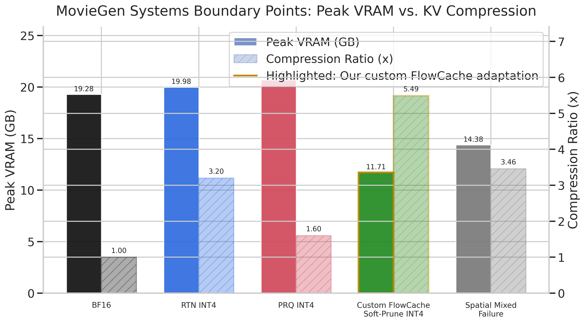
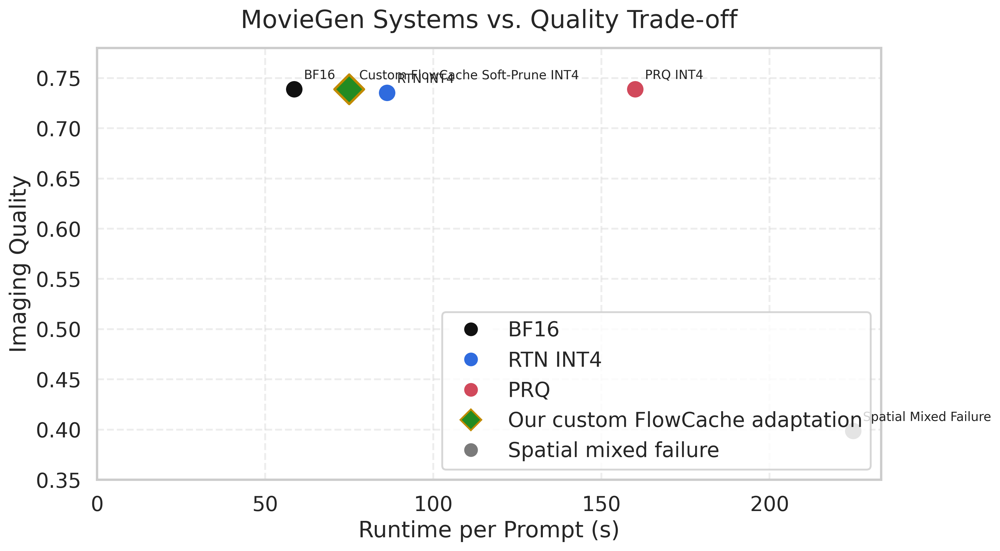

# KV Cache Quantization for Self-Forcing Video Generation

By Vaishak Menon, Suraj Ranganath, and Anish Patnaik

This repository is the research artifact for our empirical study of KV-cache quantization in self-forcing video generation. The core question is simple: as self-forcing pushes a short-horizon model to longer rollouts, which KV-cache compression methods actually help in the full system, and which ones only look promising if you ignore runtime, reconstruction overhead, or temporal drift?

We evaluate 33 quantization and cache-policy variants on MovieGen and StoryEval, measure systems behavior and output quality jointly, and package the results into a reproducible benchmark harness plus a presentation-oriented Streamlit dashboard.

## Why This Repo Exists

Self-forcing extends a short-horizon video model by repeatedly feeding generated output back in as future context. That makes long rollout possible, but it also causes the KV cache to grow with time. The result is the central tension of this project:

- We need enough compression to make longer rollouts feasible on finite hardware.
- We need enough fidelity to avoid drift, structural collapse, or hallucinated scene changes.
- We cannot judge a method from one metric alone.

That is why this repo is organized around a multi-axis empirical study rather than a single benchmark score.

## At A Glance

- `33` method variants evaluated
- `2` benchmarks: `MovieGen` and `StoryEval`
- `5+` quality/system axes tracked jointly: peak VRAM, runtime, compression ratio, perceptual realism, structural fidelity, and drift
- Streamlit dashboard with presentation mode, synchronized videos, Pareto plots, constraint rankings, traces, and prompt-level drilldowns
- Full benchmark harness for generation, evaluation, summarization, backfills, combined dataset construction, and dashboard presentation

## Curated Demo Gallery

The posters below link to short six-method comparison videos for the prompts we used most in presentation:

### MovieGen: candle / flame

[](docs/assets/media/moviegen_flame_selected_methods.mp4)

### MovieGen: coral reef / fish

[](docs/assets/media/moviegen_fish_selected_methods.mp4)

### StoryEval: bear in water

[](docs/assets/media/storyeval_bear_selected_methods.mp4)

Each comparison uses the same six presentation methods:

- `BF16`
- `FLOWCACHE_SOFT_PRUNE_INT4`
- `FLOWCACHE_PRUNE_INT4`
- `RTN_INT4_RECENT2`
- `RTN_INT4_REFRESH`
- `QUAROT_KV_INT4`

The full curated media notes, prompt texts, and dashboard walkthrough live in [docs/results_gallery.md](/data/suraj/combined-kv-quant-copilot-final/docs/results_gallery.md).

## Headline Findings

### 1. The problem is multi-objective, not one-dimensional.

A method can compress the KV cache strongly and still fail as a practical systems method if temporary BF16 reconstruction, scratch buffers, or refresh policies erase the memory savings at peak. That happened repeatedly in this study.

### 2. FlowCache-style pruning produced the strongest realized memory wins.

The clearest practical operating region was the FlowCache branch, especially `FLOWCACHE_SOFT_PRUNE_INT4` and `FLOWCACHE_PRUNE_INT4`.

- On MovieGen, `FLOWCACHE_SOFT_PRUNE_INT4` reaches about `5.49x` KV compression with about `11.23 GB` peak VRAM and `0.739` imaging quality.
- `FLOWCACHE_PRUNE_INT4` lands in a very similar systems region, but trades more structural fidelity for slightly simpler behavior.

### 3. Quality-preserving quantization ideas were still valuable even when peak VRAM did not improve.

`QUAROT_KV_INT4`, `RTN_INT4_RECENT2`, and `RTN_INT4_REFRESH` matter because they isolate useful research directions:

- outlier handling and rotation can preserve fidelity better
- recency-aware protection helps more than naive uniform quantization
- cadence and refresh policy matter for quality, even if the current memory integration is imperfect

These are important research outcomes even when the current implementation does not convert them into lower peak VRAM.

### 4. Perceptual realism and structural fidelity can diverge sharply.

One of the central lessons of the repo is the split between:

- perceptual realism: does the output still look plausible?
- structural fidelity: does it still stay close to the BF16 reference video?

The FlowCache-style soft-prune branch is the clearest example of this tension: visually strong outputs can still diverge substantially from the BF16 baseline under SSIM / LPIPS / PSNR.

## Benchmark Design

### MovieGen

MovieGen is our single-shot setting. It is the cleanest place to compare per-prompt fidelity, realism, compression ratio, runtime, and peak VRAM under a shared prompt suite.

### StoryEval

StoryEval is our narrative / rollout stability setting. It is where drift and temporal degradation become easier to see, especially through the drift-last imaging-quality signal and prompt-level qualitative playback.

## Quality Is Measured On Two Axes

### Perceptual realism

Measured primarily with VBench-derived signals:

- `background_consistency`
- `imaging_quality`
- `subject_consistency`
- `aesthetic_quality`

### Structural fidelity

Measured relative to the BF16 baseline:

- `SSIM`
- `LPIPS`
- `PSNR`

We keep these separate deliberately. A method can still make a pleasing video while drifting structurally away from BF16.

## Method Coverage

We evaluate 33 method variants across several design families:

- `BF16`: uncompressed reference
- `RTN`: naive low-bit round-to-nearest baselines, plus refresh/recent-context variants
- `KIVI`: asymmetric key/value quantization
- `QuaRot`: Hadamard-rotation quantization for outlier suppression
- `PRQ`, `QAQ`, `TPTQ`: custom higher-fidelity or outlier-aware quantizers
- `Age-Tier`: recency-aware temporal quantization
- `FlowCache variants`: hybrid, adaptive, prune, soft-prune, and native-style reuse ideas
- `Spatial mixed precision`: foreground/background precision partitioning

The full grouped catalog, rationale, and method-by-method description are in [docs/method_catalog.md](/data/suraj/combined-kv-quant-copilot-final/docs/method_catalog.md).

## Repository Highlights

### 1. Benchmark harness

The `scripts/` directory contains the full experiment flow:

- environment bootstrap
- dependency clone and patch application
- generation
- fidelity evaluation
- VBench evaluation
- drift evaluation
- summary building
- method-specific experiment launchers
- combined registry and dataset construction
- analysis figure generation
- dashboard launch

Notable entry points:

- [scripts/09_run_full_research_pipeline.sh](/data/suraj/combined-kv-quant-copilot-final/scripts/09_run_full_research_pipeline.sh): end-to-end research pipeline
- [scripts/13_launch_dashboard.sh](/data/suraj/combined-kv-quant-copilot-final/scripts/13_launch_dashboard.sh): Streamlit presentation launcher
- [scripts/30_build_combined_comparison_dataset.py](/data/suraj/combined-kv-quant-copilot-final/scripts/30_build_combined_comparison_dataset.py): unified comparison dataset
- [scripts/26_generate_analysis_figures.py](/data/suraj/combined-kv-quant-copilot-final/scripts/26_generate_analysis_figures.py): paper/deck-friendly plots

### 2. Combined comparison dataset

The public-facing comparison layer is built around [results/combined/combined_comparison_dataset.csv](/data/suraj/combined-kv-quant-copilot-final/results/combined/combined_comparison_dataset.csv), which merges prompt-level records, method summaries, evaluation outputs, and provenance across runs.

This is what powers the dashboard and most of the comparative analysis in the repo.

### 3. Presentation dashboard

The dashboard at [dashboard/app.py](/data/suraj/combined-kv-quant-copilot-final/dashboard/app.py) provides:

- benchmark and run selection
- method filtering across the combined dataset
- a presentation page with synchronized videos, focused metrics, highlighted plots, and a decision tree
- executive summaries and recommendation cards
- Pareto frontier analysis
- constraint-based rankings
- detailed method exploration
- systems traces and KV-footprint plots
- quality and drift analysis
- prompt-level tables
- raw method tables
- caveats and provenance views

A full tab-by-tab guide is in [docs/dashboard_guide.md](/data/suraj/combined-kv-quant-copilot-final/docs/dashboard_guide.md).

## Figures

These are the static figures we used repeatedly while explaining the systems/quality trade space:

### Memory vs compression



### Runtime vs quality



### Temporal drift


## Public-Facing Repo Layout

```text
.
├── README.md
├── dashboard/
├── kv_quant/
├── prompts/
├── scripts/
├── docs/
│   ├── environment_setup.md
│   ├── dashboard_guide.md
│   ├── method_catalog.md
│   └── results_gallery.md
├── results/
│   ├── benchmarks/
│   ├── combined/
│   └── ...
├── report.md
├── reportv2.md
└── presentation.md
```

## Quick Start

### Environment setup

Use the detailed environment notes in [docs/environment_setup.md](/data/suraj/combined-kv-quant-copilot-final/docs/environment_setup.md).

Minimal flow:

```bash
./scripts/10_clone_deps.sh
./scripts/11_apply_self_forcing_patch.sh
conda create -n qvg_sf_infer python=3.10 -y
conda activate qvg_sf_infer
pip install -r requirements-inference.txt
```

Optional evaluation and dashboard environments are documented in the same setup guide.

### Launch the dashboard

```bash
./scripts/13_launch_dashboard.sh
```

### Build the combined dataset and figures

```bash
python scripts/30_build_combined_comparison_dataset.py
python scripts/26_generate_analysis_figures.py
```

## Dashboard: What It Gives You

If you are visiting this repo mainly to understand the results, the dashboard is the fastest path.

Use it to:

- compare prompt-matched videos across methods
- inspect systems tradeoffs with highlighted presentation methods
- switch between MovieGen and StoryEval from the same UI
- apply recommendation presets and constraint thresholds
- see Pareto-surviving methods under different objectives
- study VRAM traces and compressed-KV traces over time
- see BF16-relative deltas for fidelity and drift
- drill down to prompt-level rows and provenance

The detailed guide is in [docs/dashboard_guide.md](/data/suraj/combined-kv-quant-copilot-final/docs/dashboard_guide.md).

## Results Interpretation Guide

The repo is intentionally opinionated about how to read the study:

- `BF16` is the reference, not the deployable answer
- `FLOWCACHE_SOFT_PRUNE_INT4` is the strongest practical single-GPU operating point in the current stack
- `FLOWCACHE_PRUNE_INT4` is the stronger raw compression / memory point if you accept more quality loss
- `QUAROT_KV_INT4` is the strongest quantized fidelity baseline among the selected presentation methods
- `RTN_INT4_RECENT2` is the best practical recency-aware RTN result
- `RTN_INT4_REFRESH` is the cleanest simple policy ablation for refresh cadence

## Important Public-Repo Notes

- Local checkpoint and model directories are expected to be created with the provided setup scripts rather than bundled directly.
- Some MovieGen source videos referenced in the combined dataset came from external run roots during the original study. The repo includes curated derived media assets for presentation, and the dashboard is the canonical place to browse the full prompt-level comparisons.
- The dashboard and docs are presentation-oriented, but the raw tables and scripts are preserved so others can adapt the harness later.

## Additional Reading

- [docs/dashboard_guide.md](/data/suraj/combined-kv-quant-copilot-final/docs/dashboard_guide.md): dashboard capabilities and analysis surfaces
- [docs/method_catalog.md](/data/suraj/combined-kv-quant-copilot-final/docs/method_catalog.md): grouped description of the 33 methods
- [docs/results_gallery.md](/data/suraj/combined-kv-quant-copilot-final/docs/results_gallery.md): curated demos used in presentation
- [reportv2.md](/data/suraj/combined-kv-quant-copilot-final/reportv2.md): fuller narrative write-up of the study
- [presentation.md](/data/suraj/combined-kv-quant-copilot-final/presentation.md): deck-oriented summary and talk structure

## Future Work

- Reproduce newer long-video KV-cache methods such as QVG / QVG-Pro within the same harness
- Extend the study beyond 10-second settings to stronger long-horizon drift evaluation
- Test generalization beyond the current self-forcing stack
- Push into first-frame-grounded, embodied, and stronger consistency-sensitive settings
